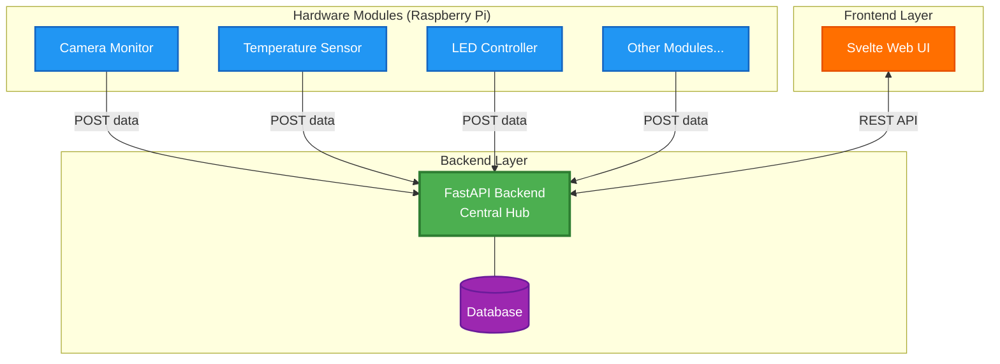

# Raspberry Pi Projects

## About
This repository contains a comprehensive IoT projects ecosystem for Raspberry Pi using a **Microservices Architecture**. The system features a hub-and-spoke topology where independent hardware modules communicate with a central **FastAPI backend**, which serves data to a modern **Svelte frontend**. Each module operates independently, making the system highly modular, scalable, and maintainable.

The architecture enables:
- **Decoupled hardware modules** that can be developed, tested, and deployed independently
- **Centralized data management** through a unified API layer
- **Real-time monitoring and control** via a responsive web interface
- **Flexible deployment** with support for Docker containerization

## Architecture Overview

The system implements a **hub-and-spoke topology** where:
- **Modules** (camera, sensors, LED controllers) are independent Python programs running on Raspberry Pi hardware
- **Backend** (FastAPI) acts as the central hub, aggregating data and managing communication
- **Frontend** (Svelte) provides a modern web interface for monitoring and control

Each hardware module independently sends data to the backend via RESTful APIs, and the frontend fetches this data for visualization. This design allows modules to be added, removed, or updated without affecting other components.



## Technology Stack

### Backend
- **FastAPI** - Modern Python web framework with automatic API documentation
- **SQLAlchemy** - Database ORM for data persistence
- **Uvicorn** - ASGI server for async support
- **SQLite** - Database option

### Frontend
- **Svelte** - Lightweight, reactive JavaScript framework
- **Vite** - Fast build tool and dev server
- **Axios/Fetch API** - HTTP client for API communication

### Hardware Modules
- **Python 3** - Module programming language
- **RPi.GPIO** / **gpiozero** - GPIO control libraries
- **Tp-link Tapo** - Camera interface
- **Requests** - HTTP library for API communication

### DevOps
- **Docker** - Containerization
- **Docker Compose** - Multi-container orchestration

## Project Structure

```
raspberrypi-projects/
├── README.md
├── .gitignore
├── backend/                          # Central FastAPI backend
│   ├── README.md
│   ├── requirements.txt
│   ├── .env.example
│   ├── main.py
│   ├── config.py
│   ├── routes/
│   │   ├── camera.py
│   │   ├── sensors.py
│   │   └── modules.py
│   ├── models/
│   │   └── schemas.py
│   ├── database/
│   │   ├── db.py
│   │   └── models.py
│   └── tests/
├── frontend/                         # Svelte frontend
│   ├── README.md
│   ├── package.json
│   ├── svelte.config.js
│   ├── vite.config.js
│   ├── src/
│   │   ├── App.svelte
│   │   ├── main.js
│   │   ├── lib/
│   │   │   ├── api/
│   │   │   │   └── client.js       # API client
│   │   │   └── components/
│   │   │       ├── CameraView.svelte
│   │   │       └── SensorDashboard.svelte
│   │   └── routes/
│   └── public/
├── modules/                          # Hardware modules
│   ├── camera-monitor/
│   │   ├── README.md
│   │   ├── requirements.txt
│   │   ├── camera_module.py        # Main module
│   │   ├── config.py
│   │   ├── wiring-diagram.png
│   │   └── tests/
│   ├── temperature-sensor/
│   │   ├── README.md
│   │   ├── requirements.txt
│   │   ├── sensor_module.py
│   │   ├── config.py
│   │   ├── wiring-diagram.png
│   │   └── tests/
│   └── led-controller/
│       ├── README.md
│       ├── requirements.txt
│       ├── led_module.py
│       ├── config.py
│       ├── wiring-diagram.png
│       └── tests/
├── shared/                           # Shared utilities
│   ├── __init__.py
│   ├── gpio_helpers.py
│   ├── message_queue.py            # For module communication
│   └── constants.py
├── docs/                            # Overall documentation
│   ├── architecture.md
│   ├── system-diagram.png
│   ├── api-documentation.md
│   └── deployment.md
└── docker/                          # Optional: Docker setup
    ├── docker-compose.yml
    ├── backend.Dockerfile
    └── frontend.Dockerfile
```

## Key Features

- **🔌 Decoupled Modules** - Hardware modules operate independently and can be developed separately
- **📈 Scalable Architecture** - Easy to add new modules without modifying existing components
- **🌐 Web-Based Interface** - Access and control your IoT devices from any device with a browser
- **⚡ Real-Time Updates** - Live data streaming from sensors and cameras
- **🔐 Centralized Data Management** - Single source of truth for all module data
- **🐳 Docker Support** - Optional containerization for easy deployment
- **📊 RESTful API** - Well-documented API for external integrations
- **🧪 Testable Components** - Each module includes its own test suite
- **📝 Comprehensive Documentation** - Detailed guides for setup and development

## Projects
- monitor-system

## Getting Started

### Prerequisites
- Raspberry Pi (3/4/5 or Zero W)
- Python 3.8+
- Node.js 16+ (for frontend)
- Docker & Docker Compose (optional)

### Quick Start

1. **Backend Setup**
   ```bash
   cd backend
   pip install -r requirements.txt
   cp .env.example .env
   # Edit .env with your configuration
   uvicorn main:app --reload
   ```
   See [backend/README.md](backend/README.md) for detailed setup.

2. **Frontend Setup**
   ```bash
   cd frontend
   npm install
   npm run dev
   ```
   See [frontend/README.md](frontend/README.md) for detailed setup.

3. **Module Setup**
   Each module has its own setup instructions:
   - [Camera Monitor](modules/camera-monitor/README.md)
   - [Temperature Sensor](modules/temperature-sensor/README.md)
   - [LED Controller](modules/led-controller/README.md)

4. **Docker Deployment (Optional)**
   ```bash
   docker-compose up -d
   ```

## Documentation

- **[Architecture Documentation](docs/architecture.md)** - Detailed system architecture and design patterns
- **[API Documentation](docs/api-documentation.md)** - Complete API reference
- **[Deployment Guide](docs/deployment.md)** - Production deployment instructions

## Standards
- Each module includes a README and wiring diagram
- Code follows Python PEP 8 style guidelines
- Tests are included for new features

## License

[MIT License](LICENSE)

