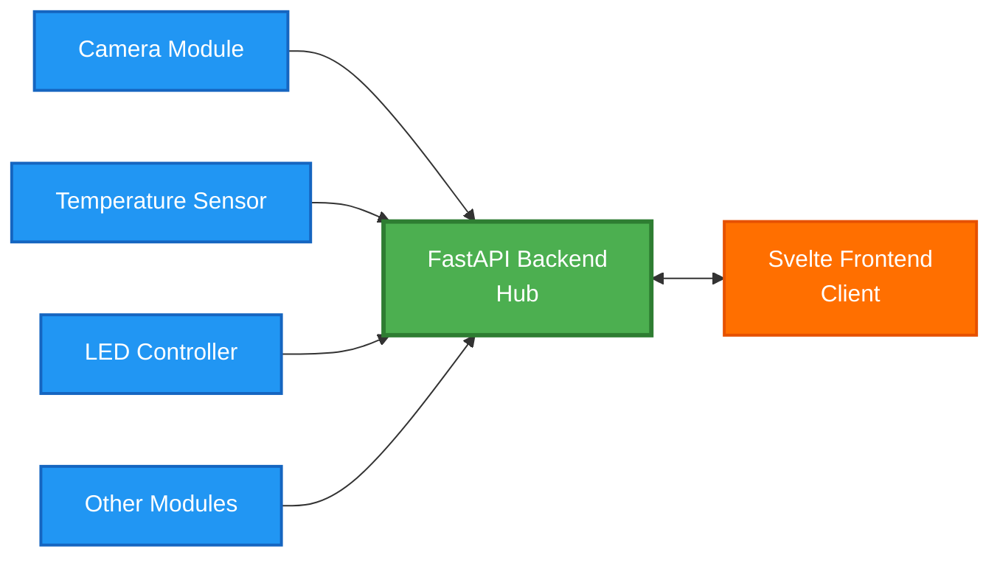
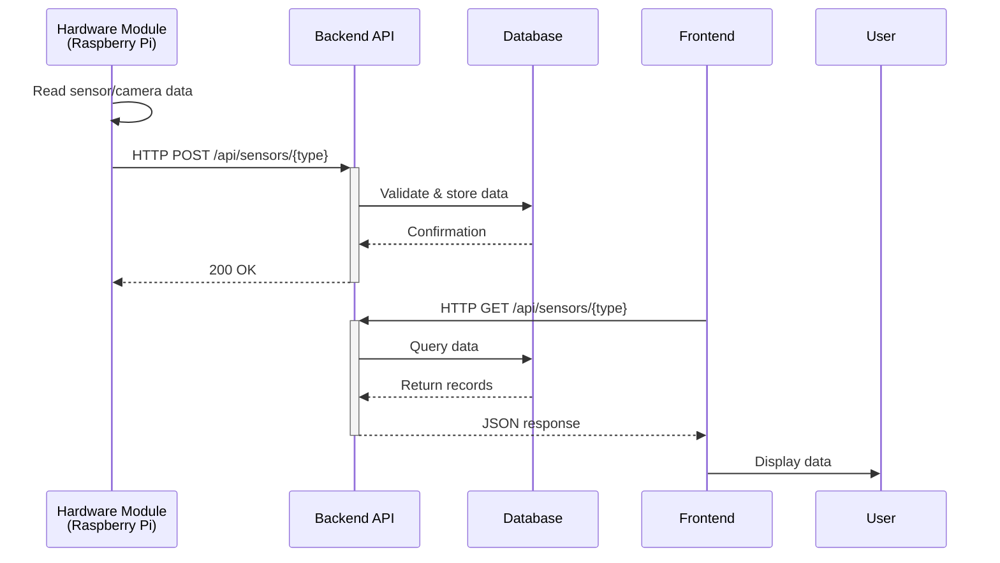
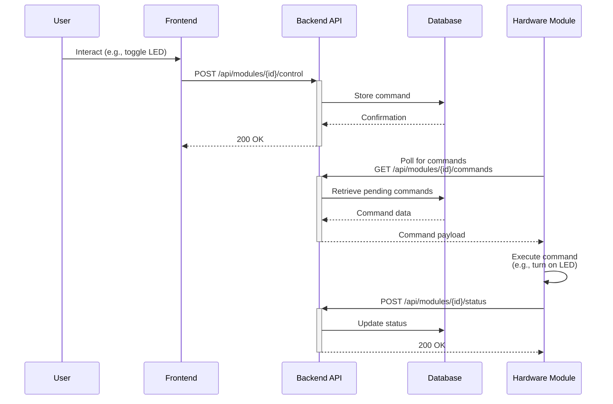
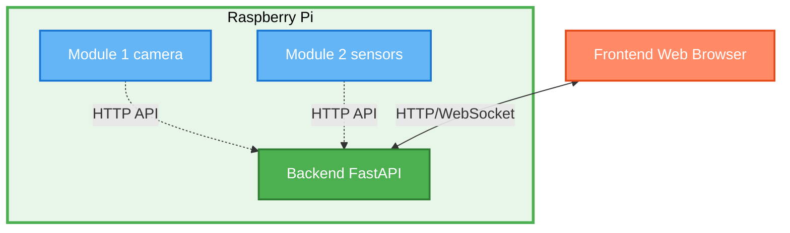
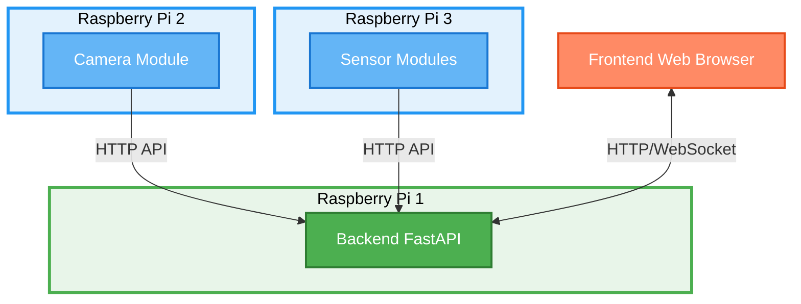

# System Architecture

## Overview

This project implements a **Microservices IoT Architecture** with a hub-and-spoke topology, where independent Raspberry Pi hardware modules communicate with a central FastAPI backend, which serves data to a Svelte frontend.

## Architecture Pattern

**Hub-and-Spoke / Star Topology with Microservices**



## Components

### 1. Backend (FastAPI)
**Location:** `/backend/`

**Responsibilities:**
- Central API hub for all communication
- Data aggregation from hardware modules
- Data storage and persistence (database)
- Business logic and data processing
- RESTful API endpoints for frontend
- Authentication and authorization

**Technology Stack:**
- FastAPI (Python)
- SQLAlchemy / PostgreSQL (or SQLite for lightweight)
- Uvicorn (ASGI server)

**Key Endpoints:**
- `POST /api/camera/frame` - Receive camera frames
- `GET /api/camera/stream` - Stream camera feed
- `POST /api/modules/{module_id}/control` - Send commands to modules

### 2. Frontend (Svelte)
**Location:** `/frontend/`

**Responsibilities:**
- User interface and visualization
- Real-time data display
- Module control interface
- Dashboards and charts
- Camera feed display

**Technology Stack:**
- Svelte / SvelteKit
- Vite (build tool)
- Chart.js or D3.js for visualizations
- WebSocket support for real-time updates

**Communication:**
- HTTP REST API calls to backend
- WebSocket connection for live data streams

### 3. Hardware Modules
**Location:** `/modules/`

**Responsibilities:**
- Interface with physical hardware (GPIO, sensors, cameras)
- Collect sensor data
- Control actuators (LEDs, motors, etc.)
- Push data to backend API
- Run independently as systemd services or cron jobs

**Module Types:**
- **Camera Monitor** - Capture and stream video/images
- **Temperature Sensor** - Read and report temperature data
- **LED Controller** - Control LED states via API commands
- **[Future modules]** - Motion sensors, humidity sensors, etc.

**Technology Stack:**
- Python
- RPi.GPIO or gpiozero
- picamera3 or external cameras (for camera modules)
- requests library (for API communication)

## Communication Flow

### Data Collection Flow



### Control Flow



## Module Independence

### Key Principle: Decoupling

Each module operates **independently** and communicates only through the API:

- ✅ Modules do NOT import backend code
- ✅ Backend does NOT import module code
- ✅ Modules can crash/restart without affecting others
- ✅ Modules can run on different Raspberry Pi devices
- ✅ New modules can be added without backend changes

### Example Module Structure

```python
# modules/temperature-sensor/sensor_module.py
import requests
import time
from sensor_library import read_temperature

API_URL = "http://backend-host:8000/api/sensors/temperature"

def main():
    while True:
        temperature = read_temperature()
        
        # Send data to backend
        response = requests.post(API_URL, json={
            "module_id": "temp-sensor-01",
            "value": temperature,
            "unit": "celsius",
            "timestamp": time.time()
        })
        
        time.sleep(60)  # Read every minute

if __name__ == "__main__":
    main()
```

## Deployment Architecture

### Single Raspberry Pi Setup



### Distributed Setup (Multiple Raspberry Pi devices)



## Data Flow Patterns

### Real-Time Data Pattern

For time-sensitive data (e.g., camera streams, live sensor readings):

1. **WebSocket Connection**: Frontend maintains WebSocket to backend
2. **Push Updates**: Backend pushes data as it arrives from modules
3. **Buffering**: Backend buffers recent data for new connections

### Historical Data Pattern

For historical analysis and trends:

1. **Scheduled Requests**: Frontend polls backend periodically
2. **Database Queries**: Backend retrieves data from database
3. **Aggregation**: Backend can aggregate data (hourly averages, etc.)

## Benefits of This Architecture

### Scalability
- Add new modules without modifying existing code
- Distribute modules across multiple Raspberry Pi devices
- Scale backend independently of modules

### Maintainability
- Clear separation of concerns
- Each component has a single responsibility
- Easy to test individual components

### Flexibility
- Modules can be written in different languages
- Easy to replace components (e.g., swap FastAPI for Flask)
- Support for multiple frontends (web, mobile, CLI)

### Reliability
- Module crashes don't affect backend or other modules
- Backend can queue commands if modules are offline
- Graceful degradation (missing data from one sensor doesn't break system)

### Development Workflow
- Develop and test modules independently
- Mock API responses for frontend development
- Backend can be developed without physical hardware

## Technology Choices

### Why FastAPI?
- Fast and modern Python framework
- Automatic API documentation (Swagger/OpenAPI)
- Built-in data validation (Pydantic)
- WebSocket support
- Async/await for high performance

### Why Svelte?
- Lightweight and fast
- Simple component model
- Reactive programming
- Small bundle sizes
- Good developer experience

### Why Independent Modules?
- Hardware-specific code isolated from business logic
- Easy to add new sensors/actuators
- Can restart modules without downtime
- Different modules can have different update cycles

## Future Enhancements

### Potential Additions

1. **Message Queue** (MQTT/Redis)
   - Replace HTTP polling with pub/sub
   - Reduce latency for real-time data

2. **Authentication**
   - JWT tokens for API security
   - User management in backend

3. **Docker Deployment**
   - Containerize backend and frontend
   - Easier deployment and updates

4. **Module Discovery**
   - Auto-register modules with backend
   - Dynamic module management

5. **Data Analytics**
   - Time-series database (InfluxDB)
   - Advanced visualization and alerts

## Getting Started

See individual component READMEs for setup instructions:

- [Backend Setup](/backend/README.md)
- [Frontend Setup](/frontend/README.md)
- [Module Development Guide](/modules/README.md)

## Architecture Diagram

For visual diagrams and system flow charts, see:
- `system-diagram.png` - Overall system architecture
- `data-flow-diagram.png` - Detailed data flow
- Individual module wiring diagrams in `/modules/{module-name}/`
